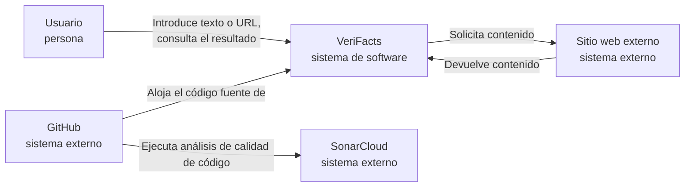

# C4 — Nivel 1: Contexto de VeriFacts

## Descripción

El diagrama presenta VeriFacts dentro de su entorno y muestra las personas y
sistemas externos que interactúan con el sistema.

## Diagrama

## Elementos

| Elemento | Tipo | Descripción |
|---|---|---|
| Usuario | Persona | Introduce texto o una URL y consulta el resultado del análisis |
| VeriFacts | Sistema de software (este sistema) | Analiza contenidos digitales y genera indicadores de posible desinformación |
| Sitio web externo | Sistema externo | Origen del contenido cuando el usuario proporciona una URL |
| GitHub | Sistema externo | Aloja el código fuente y ejecuta GitHub Actions |
| SonarCloud | Sistema externo | Analiza la calidad del código del repositorio |

Ver también el diagrama de Nivel 2: [C4 — Contenedores](02-contenedores.md).
