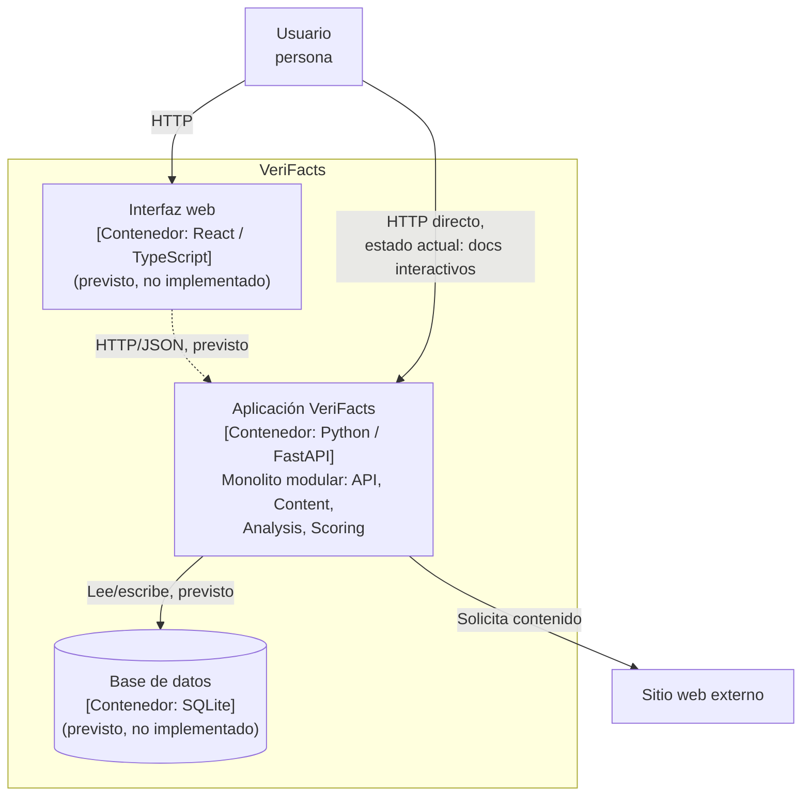

# C4 — Nivel 2: Contenedores de VeriFacts

## Descripción

El diagrama de contenedores muestra las unidades desplegables/ejecutables
que componen VeriFacts y cómo se comunican. En este incremento existe un
único contenedor en ejecución: la aplicación FastAPI (monolito modular). El
frontend web y la base de datos son contenedores previstos, todavía no
implementados.

## Diagrama

## Contenedores

| Contenedor | Tecnología | Estado | Descripción |
|---|---|---|---|
| Aplicación VeriFacts | Python 3.11 + FastAPI + Uvicorn | **Implementado (esqueleto)** | Expone la API HTTP; internamente organizada en los módulos `API`, `Content`, `Analysis`, `Scoring` (ver [Sección 5 — Vista de bloques](../arc42/05-vista-de-bloques.md)) |
| Base de datos | SQLite + SQLAlchemy | Previsto | Persistencia del historial de análisis (fecha, contenido, score, clasificación, factores) |
| Interfaz web | React + TypeScript | Previsto | Interfaz para que el usuario introduzca contenido y visualice el resultado |

## Nota sobre el estado actual

Hoy, el único punto de entrada verificable es la API HTTP directamente (por
ejemplo mediante `http://127.0.0.1:8000/health` o `http://127.0.0.1:8000/docs`),
tal como se documenta en el
[corte vertical ejecutable del README](../../README.md#corte-vertical-ejecutable).
El contenedor de interfaz web y el de base de datos se representan aquí
porque forman parte de la arquitectura objetivo (ver
[Sección 1 — Alcance](../arc42/01-introduccion-y-objetivos.md#15-alcance)),
pero no existen todavía como código ejecutable.

Ver también el diagrama de Nivel 1: [C4 — Contexto](01-contexto.md).
