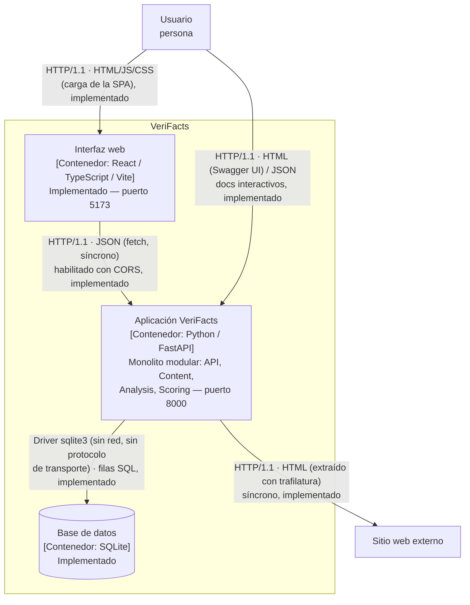

# C4 — Nivel 2: Contenedores de VeriFacts

## Descripción

El diagrama de contenedores muestra las unidades desplegables/ejecutables
que componen VeriFacts y cómo se comunican. En este incremento existen
**tres** contenedores en ejecución: la aplicación FastAPI (monolito
modular), la base de datos SQLite, y la interfaz web (React + Vite).

## Leyenda

| Notación | Significado |
|---|---|
| Rectángulo con "[Contenedor: ...]" | Unidad desplegable/ejecutable |
| Flecha continua (`-->`) | Comunicación o dependencia **implementada** |
| Flecha punteada (`-.->`) | Comunicación o dependencia **prevista, no implementada** |
| Texto "(previsto, no implementado)" dentro de un nodo | El contenedor existe en el diseño pero aún no tiene código ejecutable |
| Etiqueta sobre la flecha | `Protocolo · Formato`, seguido del estado (`implementado`/`previsto`) — ver [ADR-0003](../adr/0003-integracion-sincrona.md) para el porqué de que todas sean síncronas |

## Diagrama

## Contenedores

| Contenedor | Tecnología | Estado | Descripción |
|---|---|---|---|
| Interfaz web | React 18 + TypeScript + Vite | **Implementado** | Formulario de análisis, panel de resultado y consulta del historial paginado. No contiene lógica de negocio: solo llama a la API pública (`frontend/src/api/client.ts`) |
| Aplicación VeriFacts | Python 3.11 + FastAPI + Uvicorn | **Implementado** | Expone la API HTTP; internamente organizada en los módulos `API`, `Content`, `Analysis`, `Scoring` (ver [Sección 5 — Vista de bloques](../arc42/05-vista-de-bloques.md)); habilita CORS para el origen de la interfaz web (`app/main.py`) |
| Base de datos | SQLite | **Implementado** | Persistencia del historial de análisis (`app/persistence/repository.py`): id, contenido normalizado, score, clasificación, factores, origen (`source_type`), fecha de creación |

## Nota sobre el estado actual

Hoy existen tres puntos de entrada verificables sobre la API HTTP: el
esqueleto de disponibilidad (`GET /health`), el corte vertical completo de
análisis (`POST /analysis`, con origen `text` o `url` y persistencia real
en SQLite), y el historial paginado (`GET /analysis`, `GET /analysis/{id}`),
tal como se documenta en el
[corte vertical ejecutable del README](../../README.md#corte-vertical-ejecutable)
y en la [Sección 6 — Vista de ejecución](../arc42/06-vista-de-ejecucion.md).
La interfaz web consume los tres desde el navegador.

**Corrección S7:** la flecha `API → Sitio web externo` aparecía antes
punteada, marcada "previsto, no implementado". Eso dejó de ser cierto
desde que `app/modules/content/service.py` incorporó
`extract_from_url()` (vía `trafilatura`), y hoy está reflejada como
implementada más arriba. Todas las flechas del diagrama son hoy
implementadas y síncronas; el contrato formal de cada una vive en
[docs/contracts/openapi.yaml](../contracts/openapi.yaml) y la decisión de
mantenerlas síncronas está en [ADR-0003](../adr/0003-integracion-sincrona.md).

Ver también el diagrama de Nivel 1: [C4 — Contexto](01-contexto.md) y el de
Nivel 3: [C4 — Componentes](03-componentes.md).
