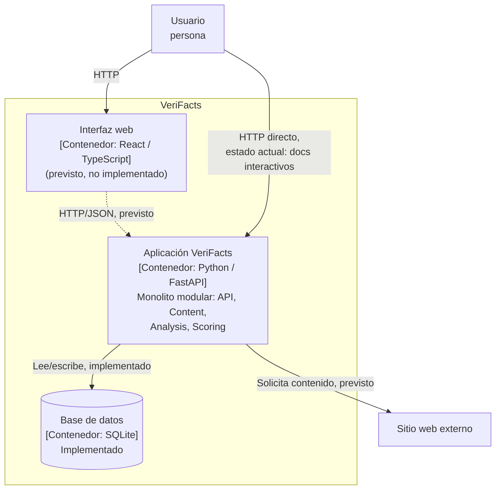

# C4 — Nivel 2: Contenedores de VeriFacts

## Descripción

El diagrama de contenedores muestra las unidades desplegables/ejecutables
que componen VeriFacts y cómo se comunican. En este incremento existen dos
contenedores en ejecución: la aplicación FastAPI (monolito modular) y la
base de datos SQLite. El frontend web es el único contenedor todavía
previsto y no implementado.

## Leyenda

| Notación | Significado |
|---|---|
| Rectángulo con "[Contenedor: ...]" | Unidad desplegable/ejecutable |
| Flecha continua (`-->`) | Comunicación o dependencia **implementada** |
| Flecha punteada (`-.->`) | Comunicación o dependencia **prevista, no implementada** |
| Texto "(previsto, no implementado)" dentro de un nodo | El contenedor existe en el diseño pero aún no tiene código ejecutable |

## Diagrama

## Contenedores

| Contenedor | Tecnología | Estado | Descripción |
|---|---|---|---|
| Aplicación VeriFacts | Python 3.11 + FastAPI + Uvicorn | **Implementado** | Expone la API HTTP; internamente organizada en los módulos `API`, `Content`, `Analysis`, `Scoring` (ver [Sección 5 — Vista de bloques](../arc42/05-vista-de-bloques.md)) |
| Base de datos | SQLite | **Implementado** | Persistencia del historial de análisis (`app/persistence/repository.py`): id, contenido normalizado, score, clasificación, factores |
| Interfaz web | React + TypeScript | Previsto | Interfaz para que el usuario introduzca contenido y visualice el resultado |

## Nota sobre el estado actual

Hoy existen dos puntos de entrada verificables sobre la API HTTP: el
esqueleto de disponibilidad (`GET /health`) y el corte vertical completo
(`POST /analysis`, con persistencia real en SQLite), tal como se documenta
en el
[corte vertical ejecutable del README](../../README.md#corte-vertical-ejecutable)
y en la [Sección 6 — Vista de ejecución](../arc42/06-vista-de-ejecucion.md).
El único contenedor que se representa aquí sin código ejecutable todavía es
la interfaz web, porque forma parte de la arquitectura objetivo (ver
[Sección 1 — Alcance](../arc42/01-introduccion-y-objetivos.md#15-alcance))
pero aún no existe.

Ver también el diagrama de Nivel 1: [C4 — Contexto](01-contexto.md).
