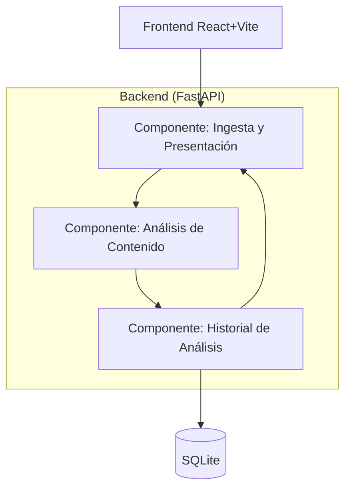

# C4 · Nivel 3 (Componentes) — Contenedor Backend

## Correspondencia con el código

🔍 Completa esta tabla señalando la carpeta/archivo real de cada componente:

| Componente | Carpeta/archivo en el repositorio |
|---|---|
| Ingesta y Presentación | (ej. `app/routers/`) |
| Análisis de Contenido | (ej. `app/services/analysis/`) |
| Historial de Análisis | (ej. `app/repositories/` o similar) |

## ¿Este diagrama reemplaza algo que ya tenían?

- Si el C4 de contenedores ya mostraba "Backend" como una sola caja, este nivel 3 es nuevo y se agrega sin tocar el nivel 2.
- Si ya existía algún diagrama de componentes con nombres distintos a estos tres contextos, hay que decidir: o el diagrama viejo se actualiza para reflejar los contextos, o se documenta por qué coexisten dos formas de ver la misma estructura (normalmente no conviene esto último).
