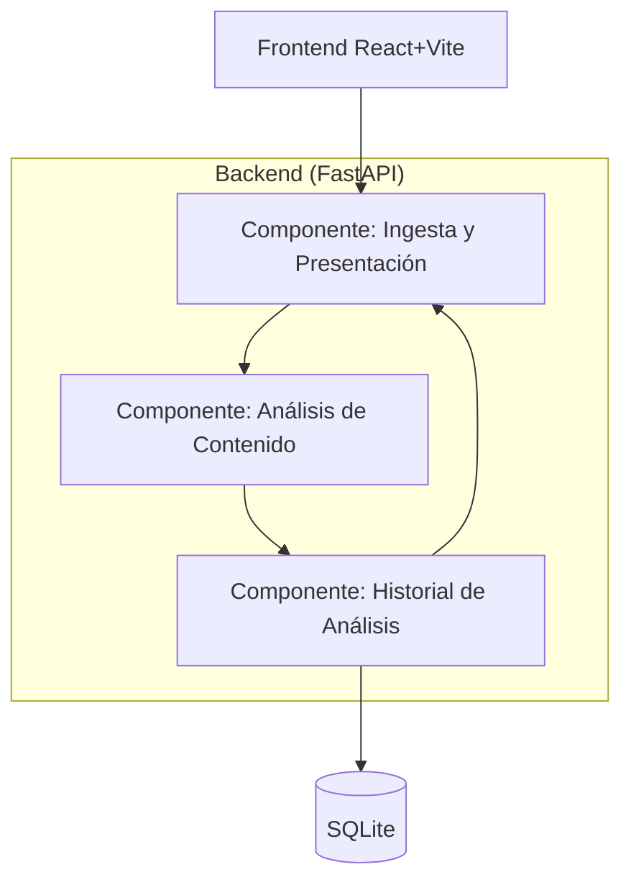

# C4 · Nivel 3 (Componentes) — Contenedor Backend

## Correspondencia con el código

| Componente | Carpeta/archivo en el repositorio |
|---|---|
| Ingesta y Presentación | `app/api/routes.py`, `app/main.py` |
| Análisis de Contenido | `app/modules/content/service.py`, `app/modules/analysis/analyzer.py`, `app/modules/analysis/service.py`, `app/modules/scoring/service.py` |
| Historial de Análisis | `app/persistence/repository.py` |

## Relación con el corte 1

Los tres contextos no cambiaron desde el corte 1; ver
[ADR-0002](../adr/0002-contextos-sin-cambios.md) para el razonamiento completo.
