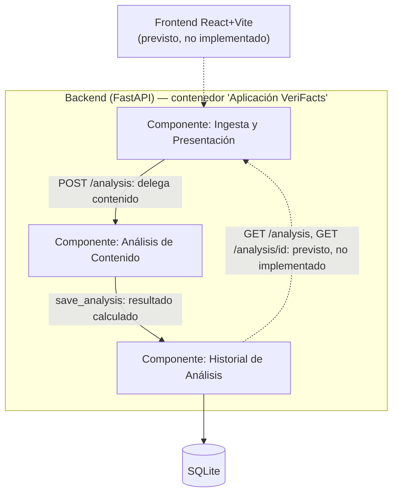

# C4 · Nivel 3 (Componentes) — Contenedor "Aplicación VeriFacts"

## Descripción

Este diagrama refina el contenedor "Aplicación VeriFacts" del
[C4 Nivel 2 — Contenedores](02-contenedores.md) en sus tres contextos
delimitados (ver [`docs/mapa-contextos.md`](../mapa-contextos.md) y
[arc42 §8.6](../arc42/08-conceptos-transversales.md#86-modelo-de-dominio-y-contextos-delimitados-s6)).
No reemplaza el Nivel 2 ni la vista de bloques por 5 módulos de la
[Sección 5](../arc42/05-vista-de-bloques.md) (`API`, `Content`, `Analysis`,
`Scoring`, `Persistencia`): es una segunda forma de agrupar los mismos
bloques, organizada por responsabilidad de dominio (DDD) en vez de por capa
técnica. La tabla de correspondencia de abajo hace explícita esa relación
para que ambas vistas se lean como coherentes entre sí.

## Leyenda

Misma notación que el [Nivel 2](02-contenedores.md#leyenda): flecha continua
(`-->`) = comunicación implementada; flecha punteada (`-.->`) = prevista, no
implementada.

## Diagrama

## Correspondencia con el código

| Componente (contexto) | Carpeta/archivo real | Bloque(s) de la Sección 5 |
|---|---|---|
| Ingesta y Presentación | `app/main.py`, `app/api/routes.py`, `app/modules/content/service.py` | `API` + `Content` |
| Análisis de Contenido | `app/modules/analysis/analyzer.py`, `app/modules/analysis/service.py`, `app/modules/scoring/service.py` | `Analysis` + `Scoring` |
| Historial de Análisis | `app/persistence/repository.py` | `Persistencia` |

**Por qué Content va dentro de "Ingesta y Presentación" y no de "Análisis":**
`normalize_content()` valida forma de entrada (espacios, contenido vacío),
no señales de desinformación — coincide con la descripción de este contexto
en `mapa-contextos.md` ("valida el formato de entrada... no conoce cómo se
calcula un score").

**Por qué Scoring va dentro de "Análisis de Contenido" y no de un cuarto
contexto:** `mapa-contextos.md` describe este contexto como el que "combina
el motor de reglas... para producir una Puntuación y una lista de
Factores" — Scoring es quien produce esa Puntuación, así que pertenece al
núcleo del dominio, no al soporte.

## Estado de las relaciones del diagrama

- `Ingesta → Análisis` y `Análisis → Historial`: **implementadas**, cubiertas
  end-to-end por `tests/test_analysis.py`.
- `Historial → Ingesta`: **prevista, no implementada**. Corresponde a los
  endpoints de lectura (`GET /analysis/{id}`, `GET /analysis`) que hoy no
  existen en `app/api/routes.py`. No usar esta flecha como evidencia de
  código funcionando hasta que esos endpoints se implementen.
- `Frontend → Ingesta`: **prevista, no implementada** (ver
  [Nivel 2](02-contenedores.md)).
