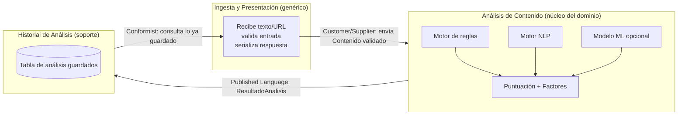

# Mapa de contextos · VeriFact

## Contextos identificados

## Descripción de cada contexto

- **Ingesta y Presentación** — recibe el texto o la URL del usuario, valida el formato de entrada y da forma a la respuesta que ve el frontend. No conoce cómo se calcula un score, solo pasa datos.
- **Análisis de Contenido (núcleo)** — combina el motor de reglas, el motor NLP y el modelo ML opcional para producir una Puntuación y una lista de Factores. Es el corazón del dominio: aquí vive el conocimiento de qué hace que un contenido parezca desinformación.
- **Historial de Análisis (soporte)** — persiste los resultados y permite consultarlos después. No sabe cómo se calculó un resultado, solo lo guarda y lo devuelve.

## Relaciones entre contextos

| Relación | Patrón DDD | Qué significa aquí |
|---|---|---|
| Ingesta → Análisis | Customer/Supplier | Ingesta decide la forma del Contenido que entra; Análisis depende de ese contrato pero no controla la validación |
| Análisis → Historial | Published Language | Análisis emite un objeto de resultado con forma fija (score, clasificación, factores); Historial solo lo consume y persiste |
| Historial → Ingesta | Conformist | Cuando Ingesta pide el historial para mostrarlo, se ajusta a la forma en que Historial ya lo tiene guardado |

